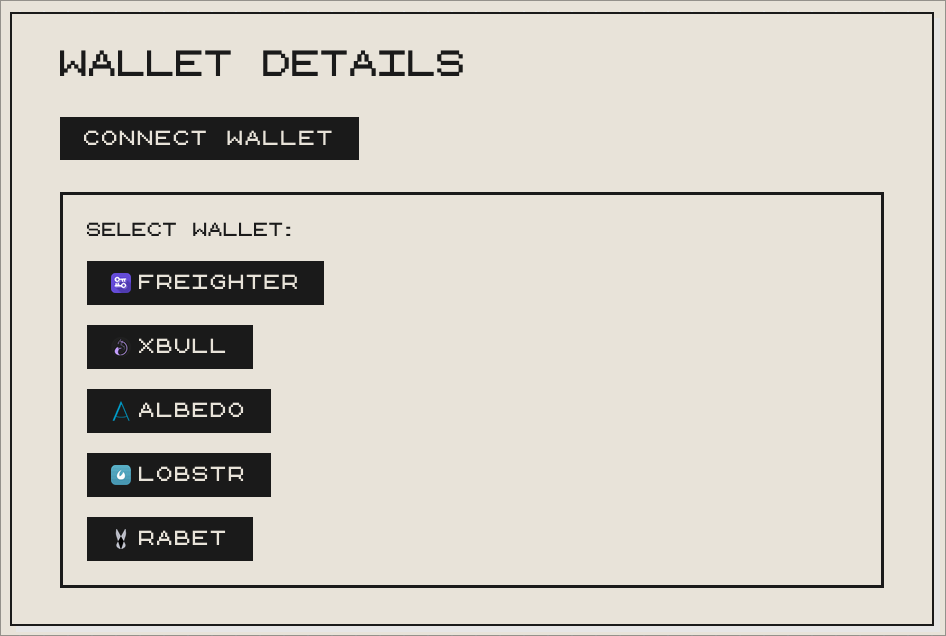

# Stellar Token Swap Interface

- live demo link: https://stellar-token-swap-interface-app.vercel.app/

A decentralized token swap interface built on the **Stellar Testnet** using **Soroban smart contracts**. The application allows users to connect their wallet, select token pairs, and execute on-chain swap transactions with real-time event tracking.

## Screenshots

> Shows all available wallet options 



---

## Deployed Contract

| Info | Value |
|------|-------|
| **Contract Address** | `CC4RA3KPXMFNXJFR4KWIBBYYIUDMLZDMKULGCJGZ4CS4U7YNQXINLOZ3` |
| **Network** | Stellar Testnet |
| **Transaction Hash** | `cf7b90e3f13d7dd3f7d527a5882a59b08f62bd7d3ad1c2faa55fc9fe61d714c3` |
| **Explorer** | [View on Stellar Expert](https://stellar.expert/explorer/testnet/contract/CC4RA3KPXMFNXJFR4KWIBBYYIUDMLZDMKULGCJGZ4CS4U7YNQXINLOZ3) |


## Setup & Installation

### Prerequisites

- **Node.js** ≥ 18
- **npm** ≥ 9
- **Freighter Wallet** browser extension ([freighter.app](https://freighter.app))
- **Rust** & **Soroban CLI** 

### 1. Clone the Repository

```bash
git clone https://github.com/MrShiroLu/stellar-token-swap-interface.git
cd stellar-token-swap-interface
```

### 2. Install Dependencies

```bash
npm install
```

### 3. Run the Development Server

```bash
npm start
```

### 4. Connect Your Wallet

1. Install the [Freighter](https://freighter.app) browser extension
2. Switch to **Stellar Testnet** in Freighter settings
3. Fund your account at [friendbot.stellar.org](https://friendbot.stellar.org)
4. Click **"CONNECT WALLET"** in the app and select Freighter

## Smart Contract

The Soroban smart contract is located at `swap-contract/contracts/hello-world/src/lib.rs`.

### Build & Test the Contract

```bash
cd swap-contract
cargo test
```

### Deploy to Testnet

```bash
soroban contract deploy \
  --wasm target/wasm32-unknown-unknown/release/hello_world.wasm \
  --source <YOUR_SECRET_KEY> \
  --network testnet
```
